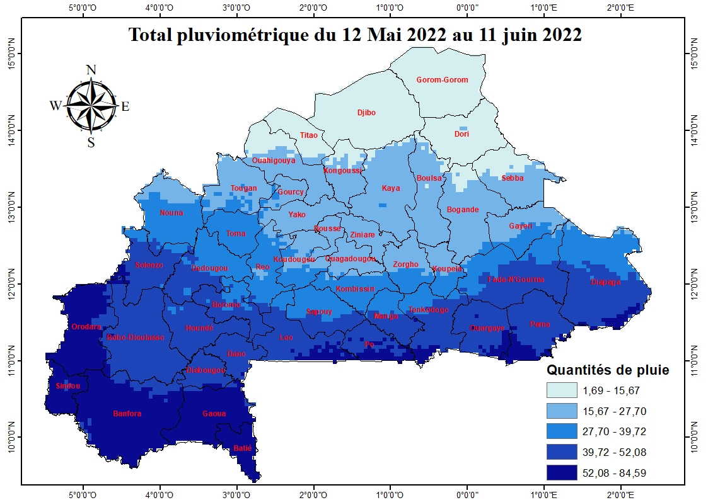
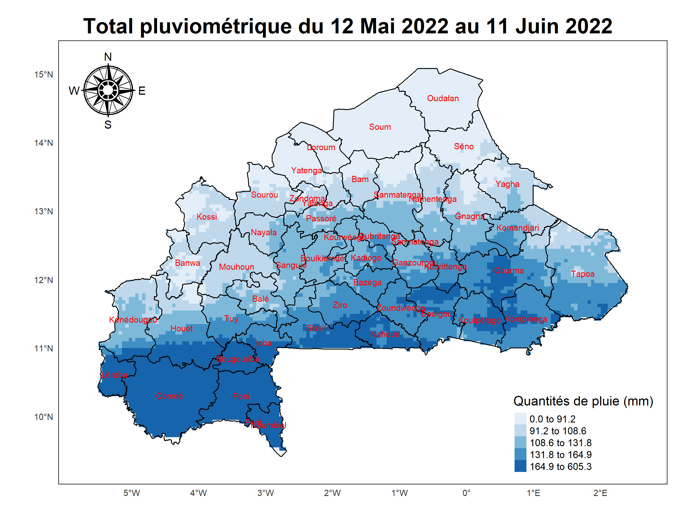

# Sample Burkina Faso forecast using tmap.

This is a sample project showing how to use the R
[tmap package](https://r-tmap.github.io/tmap/) to build a rainfall forecast
map for Burkina Faso.

The original map from ArcGIS:

The version from R with `tmap`:

